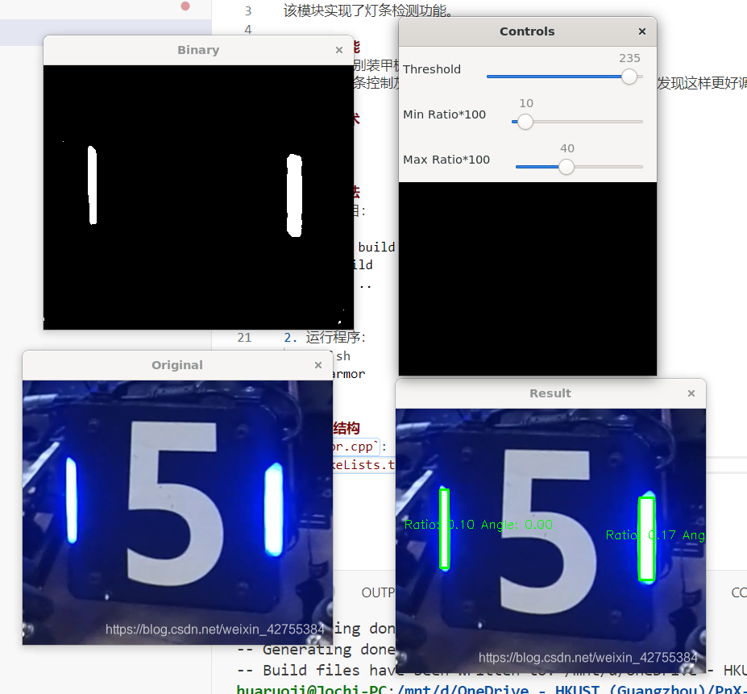

# Light Bar Detection

该模块实现了灯条检测功能。



## 主要功能
- 检测并识别装甲板上的灯条。
- 通过滑动条控制灰度的 threshold，灯条的长宽比例（因为发现这样更好调参）

## 使用技术
- OpenCV
- C++

## 使用方法
1. 编译项目：
    ```sh
    mkdir build
    cd build
    cmake ..
    make
    ```
2. 运行程序：
    ```sh
    ./light_detection
    ```

## 代码结构
- `light_detection.cpp`: 主程序文件，包含灯条检测的实现。
- `CMakeLists.txt`: CMake 构建配置文件。